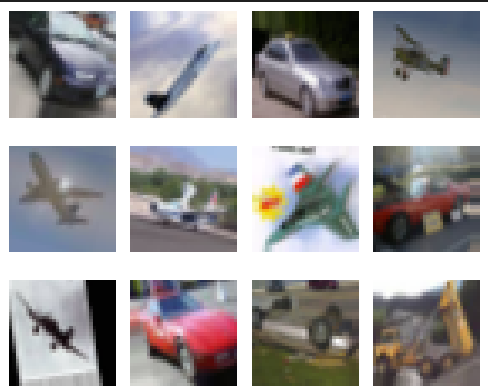
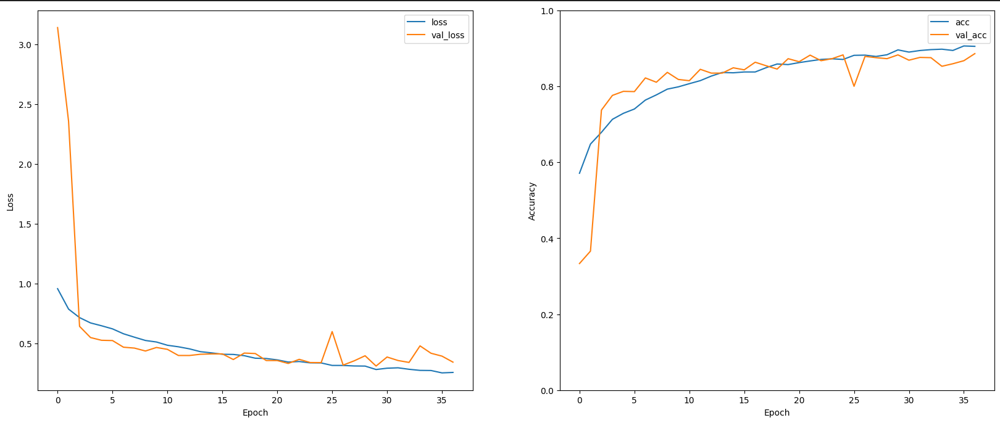
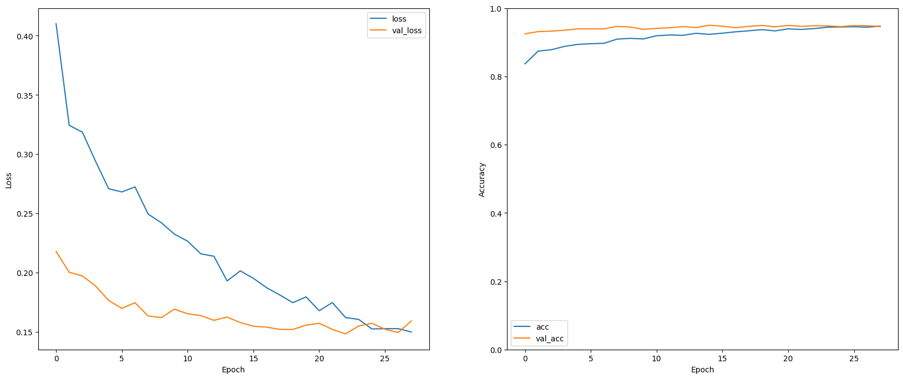

# 🧠 CNN vs Transfer Learning: Vehicle Image Classifier
This project compares 2 deep learning approaches - a custom Convolutional Neural Network (CNN) and Transfer learning - to classify images into three categories: **airplane**, **automobile**, and **truck**

---

## 🎯 Objective

To design, build, and evaluate deep learning models capable of performing accurate multi-class image classification using a real-world dataset. This includes:
- Developing two deep learning models (CNN and Transfer Learning)
- Applying regularization and tuning strategies
- Evaluating using appropriate performance metrics
- Comparing both models in terms of performance, efficiency, and learning suitability

---

## 📁 Dataset

- **Name**: `dataset_transport`
- **Classes**: 3 (airplane, automobile, truck)
- **Training Set**: 6,000 images  
- **Test Set**: 1,500 images  
- **Image Resolution**: `32x32x3` (low resolution)  
- **Source**: Provided by lecturer via Brightspace

> ⚠️ The low-resolution nature of the dataset (32x32 pixels) posed a challenge for feature extraction.




---

## 🗂️ Project Structure
```
T2_221128Z_EGT214_PROJECT.ipynb
├── Data Preprocessing
├── CNN Model
│ └── Architecture, Training, Regularization
├── Summary of CNN Model
├── Transfer Learning
│ └── MobileNetV2, DenseNet121, InceptionV3 Trials
│ └── Final InceptionV3 Model
│ └── Testing TL Model
├── Summary of Transfer Learning
├── Final Comparison of CNN vs TL
```

---

## ⚙️ Tools & Libraries

- Python 3
- TensorFlow / Keras
- Matplotlib, Seaborn (for visualization)
- Scikit-learn (for evaluation metrics)

---

## 🏗️ Model Architecture

### Custom CNN (from scratch)
Input: **32×32×3**

- **Block 1:** Conv2D(32, 3×3, same, ReLU, L2=0.001) → BatchNorm → MaxPool  
- **Block 2:** Conv2D(64, 3×3, same, ReLU) → BatchNorm → MaxPool  
- **Block 3:** Conv2D(128, 3×3, same, ReLU) → BatchNorm → MaxPool  
- **Block 4:** Conv2D(256, 3×3, same, ReLU) → BatchNorm → MaxPool  
- **Classifier:** Flatten → Dense(128, ReLU) → Dropout(0.4) → Dense(3, Softmax)

### Transfer Learning Models (Baseline: frozen backbone + custom head)

All TL models use:  
**GlobalAveragePooling2D → Dense(256, ReLU) → BatchNorm → Dropout(0.3) → Dense(3, Softmax)**

**Backbones (ImageNet, `include_top=False`):**
- **MobileNetV2** (input: **224×224×3**)  
- **DenseNet121** (input: **224×224×3**)  
- **InceptionV3** (input: **299×299×3**)  

---

## 🧪 Data Augmentation & Preprocessing

- **Training set:** augmented using random rotation, shifts, horizontal flip, and zoom (model-dependent).
- **Validation/Test set:** no augmentation (only preprocessing).
- **Input resizing:** 32×32 images were resized to 224×224 (MobileNetV2/DenseNet121) and 299×299 (InceptionV3).

## 📊 Results Summary

> **Note:** For multi-class classification, the key reported metric is **validation accuracy** (generalization performance). Training accuracy is included for reference.  

| Model | Approach | Train Acc | Val Acc | Total Params | Trainable Params |
|---|---|---:|---:|---:|---:|
| Custom CNN | From scratch | 90.52% | 88.60% | 456,131 | 455,171 |
| MobileNetV2 | TL baseline (frozen backbone + custom head) | 89.20% | 87.73% | 2,587,715 | 329,219 |
| DenseNet121 | TL baseline (frozen backbone + custom head) | 88.58% | 89.27% | 7,301,699 | 263,683 |
| InceptionV3 | TL baseline (frozen backbone + custom head) | 90.83% | 93.80% | 22,329,123 | 525,827 |
| InceptionV3 | TL fine-tuned | 94.73% | **94.60%** | 22,329,123 | 7,699,139 |

**Key takeaway:** InceptionV3 achieved the strongest generalization on this dataset, outperforming the custom CNN and the other transfer learning baselines. Based on this, I selected InceptionV3 as the final model and fine-tuned the **last 50 layers**, which further improved validation performance.

## 🔍 Comparison

The **fine-tuned InceptionV3** delivered the best overall validation performance and generalization (lower validation loss and a smaller train–validation gap). The custom CNN was faster to train (5 s/epoch), but achieved lower validation performance. Although InceptionV3 was more computationally intensive (30–60 s/epoch), fine-tuning the last 50 layers produced the most accurate and reliable model for this task.

### 📈 Training Curves (Accuracy & Loss)
**Custom CNN:** shows steady learning but a larger train–validation gap and higher validation loss.  
**Fine-tuned InceptionV3:** converges faster with consistently lower validation loss and a smaller train–validation gap.




## 🧠 Key Learnings

- Designed and tuned a CNN from scratch  
- Gained hands-on experience with Transfer Learning workflows  
- Applied techniques like:
  - Batch normalization
  - Dropout & L2 regularization
  - Data augmentation
  - Fine-tuning pretrained models
- Evaluated models using multiple metrics (Accuracy, AUC, F1)
- Compared architectures to understand trade-offs

---

## 👤 Author

**Lim Jin Bin**  
AI & Data Engineering – Nanyang Polytechnic  
Module: EGT214 – Applied Deep Learning  
Admin No: 221128Z

---

## 📄 License

This project is for educational and academic use only.
